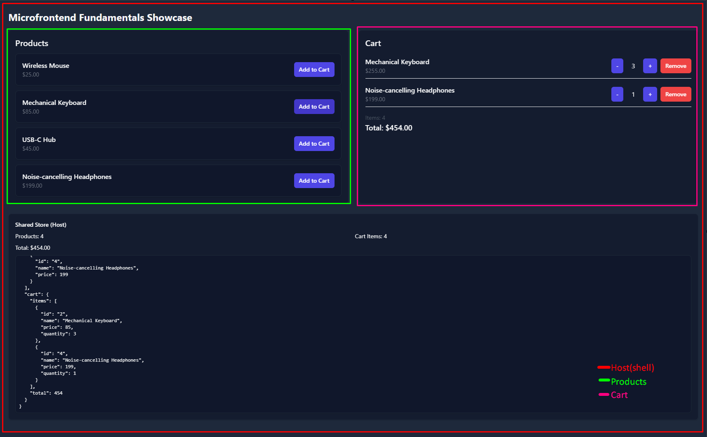

# Microfrontend Shop Showcase

A minimal e-commerce microfrontend demo built with React 18, TypeScript, Webpack 5 Module Federation, Tailwind CSS, and a shared Zustand store.



### Apps

- Host (3000): Layout shell. Exposes shared Zustand store `host/store`.
- Products (3001): Lists products. Imports store and adds items to cart.
- Cart (3002): Displays cart items and totals. Imports store and updates quantities.

## Quick Start

- Using npm workspaces (recommended):

  - npm install
  - npm run dev (starts host, products, cart together)
  - npm -w products run dev (run one app from root, example)

- Per app (separate terminals; easier logs):
  - npm --prefix host run dev (http://localhost:3000)
  - npm --prefix products run dev (http://localhost:3001)
  - npm --prefix cart run dev (http://localhost:3002)

## Directory Overview

```
/microfrontend-fundamentals
  /host
    src/ (App, StoreDebug, store)
    webpack.config.js
  /products
    src/ (ProductList, ProductCard)
    webpack.config.js
  /cart
    src/ (Cart, CartItem, CartSummary)
    webpack.config.js
  tailwind.preset.cjs
```

## Architecture

- Webpack Module Federation:
  - Host remotes: `products@http://localhost:3001/remoteEntry.js`, `cart@http://localhost:3002/remoteEntry.js`
  - Host exposes: `./store` (Zustand store)
  - Products exposes: `./ProductList`, `./ProductCard`
  - Cart exposes: `./Cart`, `./CartSummary`
- Shared singletons: `react`, `react-dom`, `zustand` (no eager)
- Async bootstrap entries (`import("./bootstrap")`) in all apps to ensure share scope is initialized before consuming shared modules.
  - This defers rendering until Module Federation initializes the shared scope, so shared singletons (React, Zustand) are safely available.
  - This avoids using `eager` for shared deps. `eager` disables code-splitting and often causes runtime races (e.g., “Shared module is not available for eager consumption”) when remotes load before the host.
- Tailwind: shared preset `tailwind.preset.cjs` consumed by each app’s `tailwind.config.cjs`.

## How it Works

- Host renders a 2-column layout: Products (left), Cart (right).
- Both remotes import `useStore` from `host/store`, so adding/removing items updates the single shared store.
- Host renders a `StoreDebug` panel to visualize store state in real time.

## Important Notes and Caveats (Showcase vs Real World)

- This is a showcase. In real-world projects:
  - Each microfrontend often owns its own state/context and can run independently.
  - Communication between microfrontends is usually via HTTP APIs, an event bus/pub-sub, URL/query state, or server-driven composition — not by exposing a shared client store.
  - Treat MF boundaries like service boundaries: prefer clear, versioned contracts instead of tight coupling.
- Avoid `eager: true` for shared deps; it commonly causes “Shared module is not available for eager consumption”.
- Ensure exact `react` and `react-dom` versions across all apps to keep singletons aligned.
- The Zustand store is cached on `globalThis.__MFE_STORE__` to guarantee a single instance even if evaluated in multiple graphs.

## Troubleshooting

- React singleton/version mismatch
  - Align `react` and `react-dom` versions in all `package.json` files.
- StoreDebug not updating
  - Ensure all apps import the store from `host/store` and that the host is running first. Refresh after changes.
